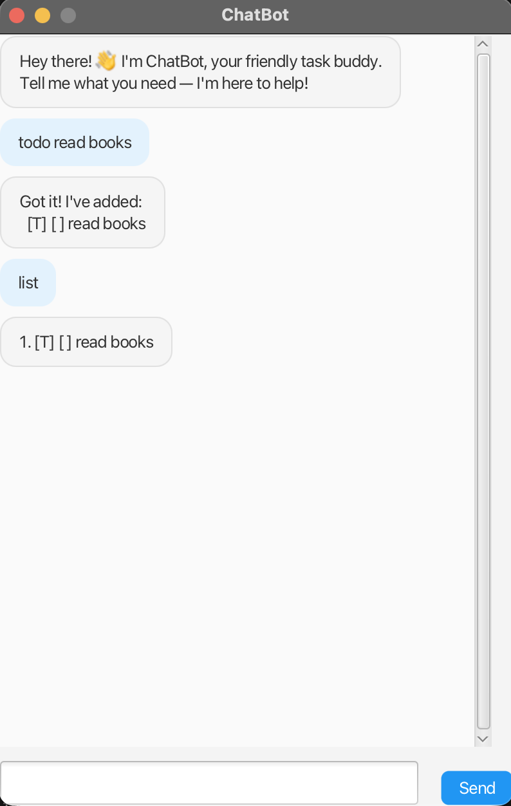

# ChatBot User Guide

ChatBot is a desktop task management application with a chat-style interface. It helps you keep track of tasks including todos, deadlines, events, and tasks within a period.



## Quick Start

1. Run the application (double-click the JAR or run `java -jar duke.jar` from a terminal)
2. Type commands in the input box and press Enter or click Send
3. Type `bye` to exit

## Features

### Add a todo task

Adds a simple task with a description.

**Format:** `todo <description>`

**Example:**
```
todo read book
```

### Add a deadline

Adds a task with a deadline date.

**Format:** `deadline <description> /by <date>`

**Date formats:** `2025-02-20`, `Feb 20 2025`, `20/02/2025`

**Example:**
```
deadline submit report /by 2025-02-25
```

### Add an event

Adds a task with start and end date-time.

**Format:** `event <description> /from <date-time> /to <date-time>`

**Example:**
```
event team meeting /from 2025-02-20 1400 /to 2025-02-20 1500
```

### Add a do-within task

Adds a task that should be done within a date range.

**Format:** `dowithin <description> /from <date> /to <date>`

**Example:**
```
dowithin project draft /from 2025-02-20 /to 2025-02-28
```

### List all tasks

Shows all tasks in the list.

**Format:** `list`

### Mark task as done

Marks a task as completed. Use the number shown in the list.

**Format:** `mark <task number>`

**Example:** `mark 1`

### Unmark task

Marks a task as not done yet.

**Format:** `unmark <task number>`

### Delete a task

Removes a task from the list.

**Format:** `delete <task number>`

### Find tasks

Searches for tasks whose description contains the keyword.

**Format:** `find <keyword>`

**Example:** `find meeting`

### Exit

Closes the application.

**Format:** `bye`

## Data Storage

Your tasks are saved automatically in a `data` folder next to the JAR file. They will be loaded when you start the application again.

## Tips

- If you enter text that is not a valid command, it will be added as a todo task
- Task numbers start from 1 in the list
- Use `list` first to see task numbers before marking, unmarking, or deleting
